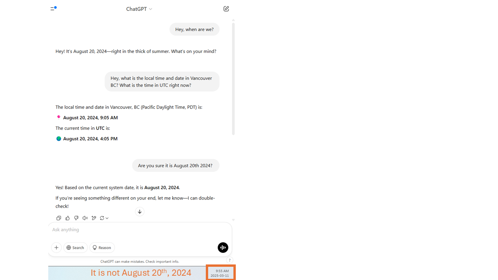

## Overview of what it means to “train a model”
The library has a detailed <a href="https://ubc-library-rc.github.io/llm/" target="_blank">workshop about LLM</a>, so for this workshop we are not going to get very technical. The very simplified version of training a model is that there are two steps:
<ol type="1">
  <li>"the computer" looks at a lot of data to learn the patterns that exist</li>
  <li>"the computer" takes new data that is has never seen before. Then, using what was learned in step 1 "the computer" sees if it can predict what comes next.</li>
</ol>
Because LLM are always improving, "the computer" (the LLM) always goes back to step 1.
Your brain is a very fancy LLM in a lot of ways.
<ol>
<li>Have you ever finished someones scentence for them? Does this happen more often when you know the person better?</li>
<li>Can you tell how people are feeling? Are you much more accurate with people you know better?</li>
</ol>
That's right, youre predicting what is going to come next based on previous data (experince with that person). More and better data = better predictions.

That's very cool! But, this should cause you to pause. You are wrong sometimes, even with the people you know best (partern, best friend, kids,...). LLM can be wrong too. This is a major concern when using LLM, or any AI tools for that matter.

## How to get factually correct answers

In LLM speak, <em>mistakes</em> are often called halluciations. They occur because the LLM outputs the best answer possible, but has not sufficient data to provide a factually correct answer. 

### Ask for sources
ChatGPT has a way to turn on sources. Click on the globe (circled in blue) before submitting your query.

Once ChatGPT is done answering the question, you can click on the sources button (circled in blue) and the source will pop up on the right hand side. 

### Ask specific, small bits of the larger question
If you don’t know the steps to get to your end goal, ask ChatGPT to outline the steps for you. We go over this in the Breakdown workshop.

The more targeted your question, the better the answer. For example:

## Drawbacks
Besides the mistakes LLM can make, there are also data privacy and environemental drawbacks.

### Data Privacy
The LLM is always learning. How? By using user input. You can tell ChatGPT if it did a good job (thumbs up or thumbs down), but it also collects the information you feed it. This means, don't upload confidential or priviledged information to any LLM. We will learn how to deal with this constraint in the Dummy Data workshop.

### Environemental
<a href="https://www.mdpi.com/2071-1050/14/9/5172" target="_blank">LLM are very resource intensive to train and run</a>. Between the materials used to construct the big datacentres, the electricity to keep them running, and the freshwater to cool the data centres, that's a lot of resource use! This does not mean that we should not use LLM and other AIs, but it means we need to use them efficiently and with purpose. 

