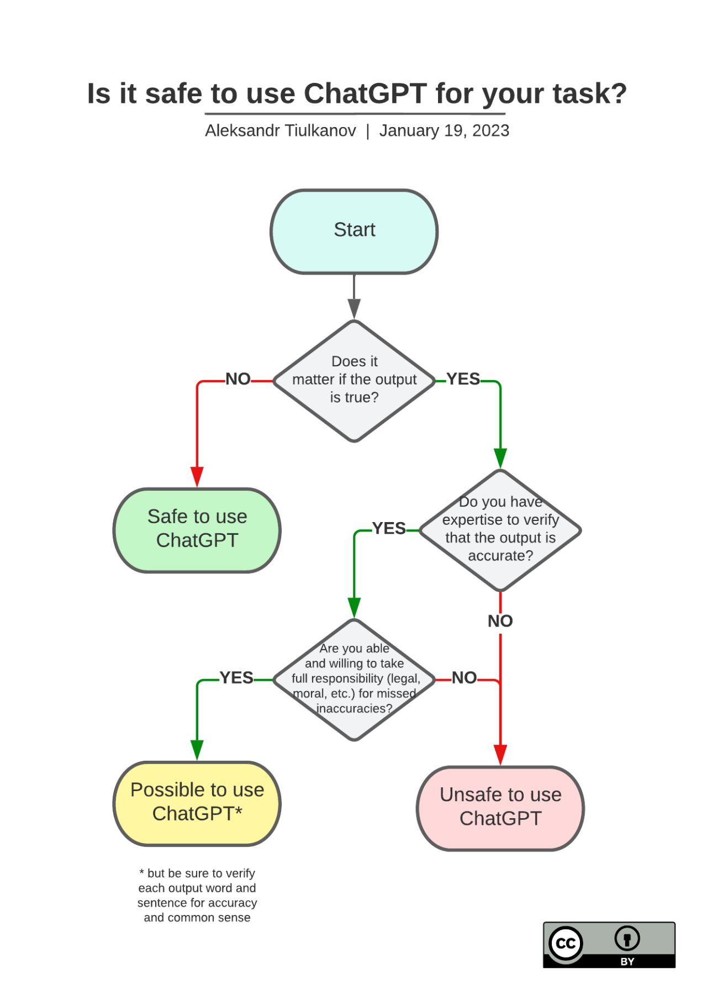
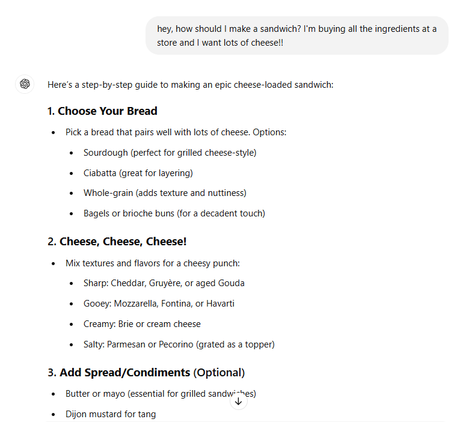
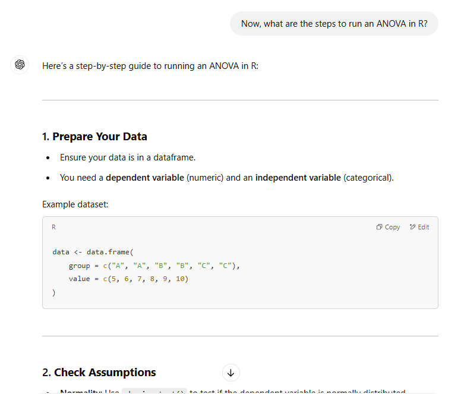

# How to ask for help 
ChatGPT will answer almost any question but there are ways to produce more useful and constructive answers. In this session we learn how to use ChatGPT to better understand existing code and how to generate new code. 

By the end of this session we hope you will:

- understand how ChatGPT can help interpret and write code for data analysis
- appreciate the value of breaking your question into steps


## When is asking AI for help appropriate? 
Here is a flowchart by <a href="https://www.linkedin.com/posts/tyulkanov_a-simple-algorithm-to-decide-whether-to-use-activity-7021766139605078016-x8Q9/" target="_blank">Aleksandr Tiulkanov</a> about when AI use is appropriate

<div style="margin-left: 5%; margin-top: 20px; margin-bottom: 40px">

</div>


## Ask the AI for help
AI can help with a lot, but today we focus on help with coding. Specifically, how to ask questions to get good, complete, answers or code from the AI.
In "AI speak", a question/text input you ask/give the AI is called a prompt. 

### AI can explain code to you
Paste in some code in ChatGPT and ask it to explain what the code means. Let's try with this code:
```
library(tidyverse)

ggplot(mtcars, aes(x=cyl, y=mpg))+
  geom_point()

```
#### Note about LLM explanations
LLMs are text generators, so when you ask them to explain something, they generate text that explains the concepts you asked about. However, LLMs do not <em>understand</em> the output. This is a small, but important distinction. It means that if the answer seems superficial and not fully satisfactory, that’s because it is. You can ask the LLM to re-phrase or re-explain, but at some point, it might be better to go look at content written by a human. 

### AI can write code for you
ChatGPT and other AI models are often text generators. Code is text, so it is well within their capabilities to code for you (most of the time). However, if we recall from last week, how questions are worded is very important, as it affects the quality and completeness of the answer the AI generates. 
In this section, we learn how to talk to the AI to get the best possible answer. 

#### Breakdown the analysis into steps: Steps to make a sandwich
Let's ask ChatGPT how to make a sandwich. You can specify preferences, like we did (cheese!).

<div style="margin-left: 5%; margin-top: 20px; margin-bottom: 40px">

</div>

#### Breakdown the analysis into steps: Steps to run an analysis of variance (ANOVA)
Something more serious, asking ChatGPT how to run an ANOVA in R. ANOVA stands for <strong>an</strong>alysis <strong>o</strong>f <strong>va</strong>riance. It is a statistical test to compare the mean of more than 2 groups. 

<div style="margin-left: 5%; margin-top: 20px; margin-bottom: 40px">

</div>

## Translate the steps into prompts
Each part of the response to the ANOVA prompt is numbered into steps. You can ask ChatGPT to help you with each part individually. 
Remember, asking multiple questions at once leads the AI to ignore parts of the prompt, so asking for small parts of the end result is the best way to get a complete answer. 
### Important terminology
You will notice in the output that there are words like "dataframe". The output from ChatGPT is a very good place to find the terms you need to know and understand as part of your analysis. 

## Notes about speaking to the AI
When you input data (usually text) in ChatGPT, the text is converted to a format the AI can understand. This sometimes leads to the AI not understanding the issue, because the issue gets formatted out. This seems to be getting rarer as the AI improves. 

Remember, the AI is not reasoning, so ask it for sources and evaluate if the output you get from the analysis makes sense with what you were expecting from your data. Having dummy (fake) datasets where you know the outcome is a great way to test if your code makes sense (more on this in the next week's workshop).


## Glossary 
Here is a link to the <a href="https://ubc-library-rc.github.io/AI_for_coding/content/Glossary.html" target="_blank">full workshop glossary</a>, but we list a few key terms form this page below:

<ol type="1">
<li>Data structures: Shapes or formats in which the entire dataset is saved. These could be a dataframe, a matrix, a list, a vector to name a few. Statistical analyses and graph generations require data in a specific format.</li>
<li>Prompt: Text input you give the LLM.</li>
</ol>


