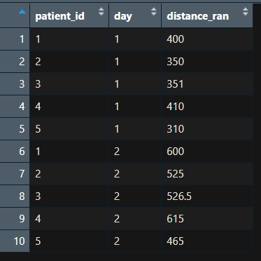
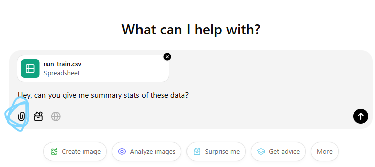

# Dummy data and privacy
ChatGPT collects all the information you feed it. We learn why using non-private dummy data is more practical and less risky in most situations. We also go over how to create dummy data, so you feel empowered to make some when the time comes. 

By the end of this session we hope you will:

- understand the privacy risks inherent in LLMs like ChatGPT
- know how to create dummy data suitable for your project

## Data Privacy
The major issue around privacy for LLM is that they take user input and incorporate it into the model. Here, we emphasize an example of a concern that arises as a consequence of the data ingestion of LLM for confidential and non-confidential data.  

### Confidential data
Patient records and Indigenous knowledge are examples of data that are confidential and should never be uploaded to LLM. These data need to be handled with care in terms of stage and who has access to the raw data, so clearly, they should not be uploaded to LLM.

### Non-confidential data
These data include data that would be made public anyways. For example, water temperature measurements that would be published along with a manuscript. Although these data do not pose the same privacy concerns as confidential data, feeding these data into LLM means that the model will use your data and will have no way of “knowing” where the data are from, so you won’t get credit for your work. 

## Dummy Data

### Why make dummy data?
Because of data privacy, we can’t always upload data to LLMs, but being able to do this is helpful when troubleshooting code or just building an analysis. Advanced coders use dummy data all the time. In addition, having fake data to work with allows you to know the results of statistical tests, which is always a good way to check code. 

### What makes a good dummy dataset
The most useful fake datasets are typically:
1.	Small
2.	With big variation among treatment groups, in order to see the difference in plots easily and guarantee a significant result when testing statistical models
3.	Similar to what your real data look like. For example if your data have three treatment groups that were measured on two different days, your fake data should also have this. Fake data should also replicate the <strong>structure of your data</strong>. So if your real data have measurements for each day in different columns, your fake data should also have that structure. The <strong>data type</strong> in your dummy data should also be the same as your real data. For example, if the data in your columns are numeric, the dummy data should also be numeric. 

### Let's make one!

<a href="https://github.com/ubc-library-rc/AI_for_coding/blob/main/content/run_train.csv" target="_blank">Dummy data file here</a>

#### in R

An example of making a dummy dataframe in R. <strong>This is the way to go if you have more complex data structures.</strong> Make sure that the format in which you save the dummy data is the same as your real data. 
```
## make vectors
patient_id = c("1", "2", "3", "4", "5",
              "1", "2", "3", "4", "5")
day = c("1", "1","1","1","1",
        "2","2","2","2","2")
distance_ran = c("400", "350", "351", "410", "310", 
                 "6000", "5250", "5265", "6150", "4650") # distances for day 2 all 15 x day 1 values

## make a dataframe
run_train = data.frame(patient_id, day, distance_ran)

## can then save as a .csv file that can be uploaded to ChatGPT
write.csv(run_train, "run_train.csv", row.names=F)

```

<div style="margin-left: 5%; margin-top: 20px; margin-bottom: 40px">

</div>

#### In Excel
<strong>This is the way to go if you have simple data structures </strong>. 
Write out the values in an Excel document and save it in the same format that your real data are in.

### Upload the dummy data to ChatGPT
Upload the data to ChatGPT (button circled in blue) and ask it for summary stats. 
<div style="margin-left: 5%; margin-top: 20px; margin-bottom: 40px">

</div>


## Glossary
<ol type="1">
 <li>Data type: The kind of data in your dataset. For example, numbers are numeric data, and letters are character data.</li> 
<li>Data structures: Shapes or formats in which the entire dataset is saved. These could be a dataframe, a matrix, a list, a vector to name a few. Statistical analyses and graph generations require data in a specific format.</li>
  <li>Dummy data: A fake dataset that has the same data types and structure as your real data. These datasets are used to make sure code works and work around data privacy and ownership concerns of using real data.</li>
</ol>

