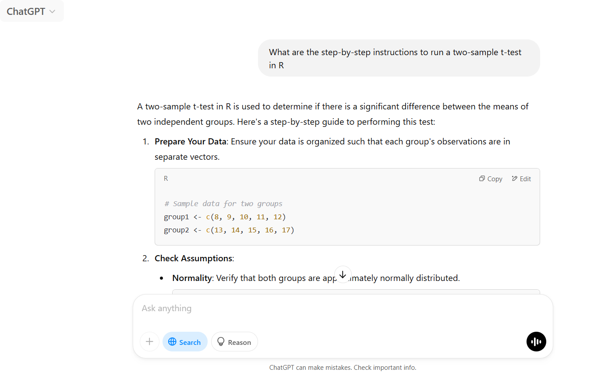

# Coding with ChatGPT 
Now that we have learned a few skills for interacting with LLMs more effectively in the previous sessions, it is time to put it all together.
We will use ChatGPT to help us run a t-test in R.

## Learning Objectives
By the end of this session we hope you will:

- understand where ChatGPT can help in a data analysis workflow
- feel confident using ChatGPT in your own coding tasks


## Ask for help (Breakdown workshop)
Ask the AI: “What are the step-by-step instructions to run a two-sample t-test in R”? Ask for sources and note down the steps.

<div style="margin-left: 5%; margin-top: 20px; margin-bottom: 40px">

</div>

## Upload data for ChatGPT to use (Dummy data workshop)
ChatGPT uses example data in the code, but using dummy data allows the generated code to use the variable names in your dataset, so you won't need to edit the code when copy/pasting it from the response. 
<ol type="1">
<li>Make a dummy dataset (<a href="https://ubc-library-rc.github.io/AI_for_coding/content/3_dummy_data.html" target="_blank">Dummy data and Privacy page</a>). Let’s make one with two columns:
  <ol type="i">
  <li>A continuous variable</li>
  <li>Indicating to which of the two groups the observation in column (i) belongs.</li>
  </ol>
</li>
<li>Upload the dummy data (if you want ChatGPT to use it to generate new example code or run the t-test on it for you).</li>
</ol>

You can use this <a href="https://github.com/ubc-library-rc/AI_for_coding/blob/main/content/pre_run_snack_effect_on_run_speed.csv" target="_blank">dummy data</a>.
It has the major important elements for a good dummy dataset: small amount of data (few observations), big variation among treatment groups (snack type), and similar to what your real data look like.

## Ask for step by step help
Go through the step-by-step instructions we got earlier and ask ChatGPT for help with each section, using your dummy data. Simultaneously, run the code yourself to see if the code ChatGPT has given you matches the desired outcome. This is the time to address errors that occur. If you are struggling to use your dummy data, it may be beneficial to use the example data provided by ChatGPT (see the example data in the vectors in the "Prepare Your Data" section of the ChatGPT screenshot above) to see if the code works on those data and then figure out what the different between the data ChatGPT provided and your data. 

### Code from ChatGPT
```
# Sample data for two groups
group1 <- c(8, 9, 10, 11, 12)
group2 <- c(13, 14, 15, 16, 17)

# Normality check using Q-Q plots
qqnorm(group1); qqline(group1)
qqnorm(group2); qqline(group2)

# Variance equality check using F-test
var.test(group1, group2)

# Two-sample t-test assuming equal variances
t.test(group1, group2, var.equal = TRUE)

# Welch's t-test (default in R)
t.test(group1, group2)
```

### R code built fom the ChatGPT output using the run speed dummy data
Note, the ChatGPT dummy data is single vectors whereas our dummy data (run speed) is in a dataframe format. 

```
# Sample data for two groups
df = read.csv("pre_run_snack_effect_on_run_speed.csv")

## subset into two groups
group1 = subset(df, df$pre_run_snack=="candy")
group2 = subset(df, df$pre_run_snack=="kale")

# Normality check using Q-Q plots
qqnorm(group1$run_speed); qqline(group1$run_speed)
qqnorm(group2$run_speed); qqline(group2$run_speed)

# Variance equality check using F-test
var.test(group1$run_speed, group2$run_speed)
## variances are unequal

# Welch's t-test (default in R)
t.test(group1$run_speed, group2$run_speed)
```

## Sanity check
Does the output make sense with your dummy data? In the case of run speed, it makes sense that the two groups are different because we made our data that way. 

