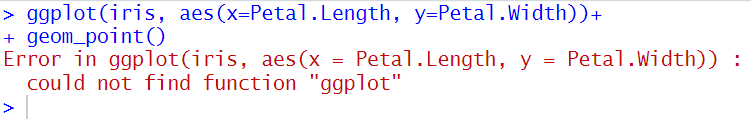
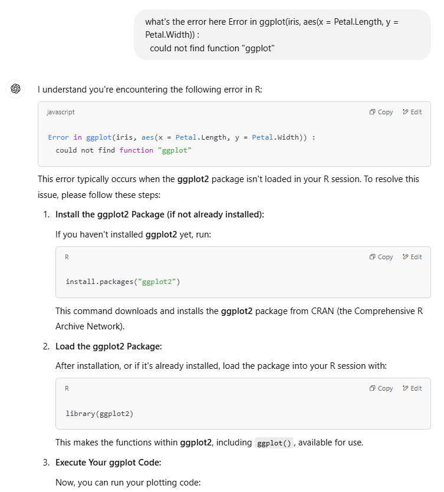

AI is good at helping toubleshoot errors because it can not only read the code for you and help find resources to solve the errors, but can also provide some additional context around the error.

# Examples with different types of errors
## Package not found
A very common R package used to make plots in R is <a href="https://ggplot2.tidyverse.org/" target="_blank">ggplot2</a>. From a new R session, let's try to use ggplot2 to make a plot with the `iris` defaut dataset

```
ggplot(iris, aes(x=Petal.Length, y=Petal.Width))+
  geom_point()
```
Copy/paste the error in ChatGPT
<em>Error in ggplot(iris, aes(x = Petal.Length, y = Petal.Width)) : could not find function "ggplot"</em>

<div style="margin-left: 5%; margin-top: 20px; margin-bottom: 40px">

</div>

Look over the answer and see what the fix here. Here, the issue is that `ggplot2` is not installed and/or loaded. 

<div style="margin-left: 5%; margin-top: 20px; margin-bottom: 40px">

</div>

Try the fix and see if it works. 

## File or variable not found

## Code syntax incorrect

## Data format incorrect 

## Need help undertsanding code
