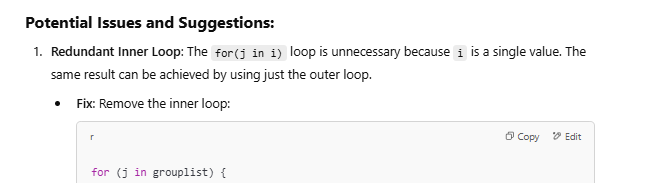

AI is good at helping toubleshoot errors because it can not only read the code for you and help find resources to solve the errors, but can also provide some additional context around the error.

# Examples with different types of errors
## Package not found
A very common R package used to make plots in R is <a href="https://ggplot2.tidyverse.org/" target="_blank">ggplot2</a>. From a new R session, let's try to use ggplot2 to make a plot with the `iris` defaut dataset

```
ggplot(iris, aes(x=Petal.Length, y=Petal.Width))+
  geom_point()
```
<div style="margin-left: 5%; margin-top: 20px; margin-bottom: 40px">

</div>

Copy/paste the error in ChatGPT
<span style="color: red;"><em>Error in ggplot(iris, aes(x = Petal.Length, y = Petal.Width)) : could not find function "ggplot"</em></span>

Look over the answer and see what the fix here. Here, the issue is that `ggplot2` is not installed and/or loaded. 

<div style="margin-left: 5%; margin-top: 20px; margin-bottom: 40px">

</div>

Try the fix and see if it works. 

## Other common errors that ChatGPT can help with 
### Object not found 
Example, you are asking R to use a dataframe that has not yet been imported into R. 

### Code syntax incorrect
Things like typos or missing parts of the code needed to run something. 

### Data format incorrect 
For example, the data need to be in a matrix form, but they are a currently dataframe. 


## Need help undertsanding code
Chat GPT is very good at explaining what the code is doing. For example, pretend your coworker sent you code for a for loop that you have never seen before, and it has no comments!!! What a cardinal coding sin. ChatGPT can help: 

```
top.df = NULL

grouplist = c(unique(all.df$taxaplot_group))

for(i in grouplist) {
  for(j in i) {

    sample = subset(sorted, sorted$taxaplot_group %in% c(j))

    top = sample[c(1:5),]

    t.tmp <- top
    t.tmp$which_group = j
    top.df <- rbind.fill(top.df, t.tmp)

  }
}
```
<div style="margin-left: 5%; margin-top: 20px; margin-bottom: 40px">

</div>
ChatGPT wil also suggest how to improve code, which may of may not be important or relevant. This is more of a good to know for more advanced coders. 
<div style="margin-left: 5%; margin-top: 20px; margin-bottom: 40px">

</div>

